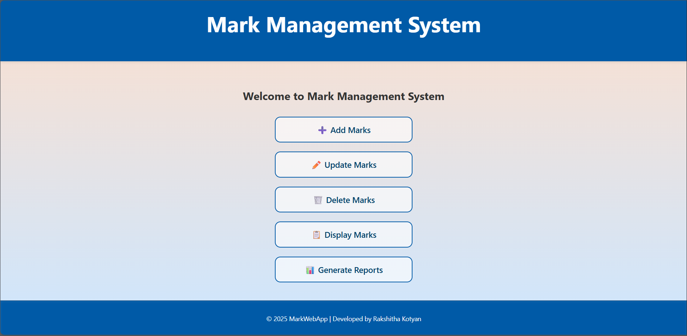
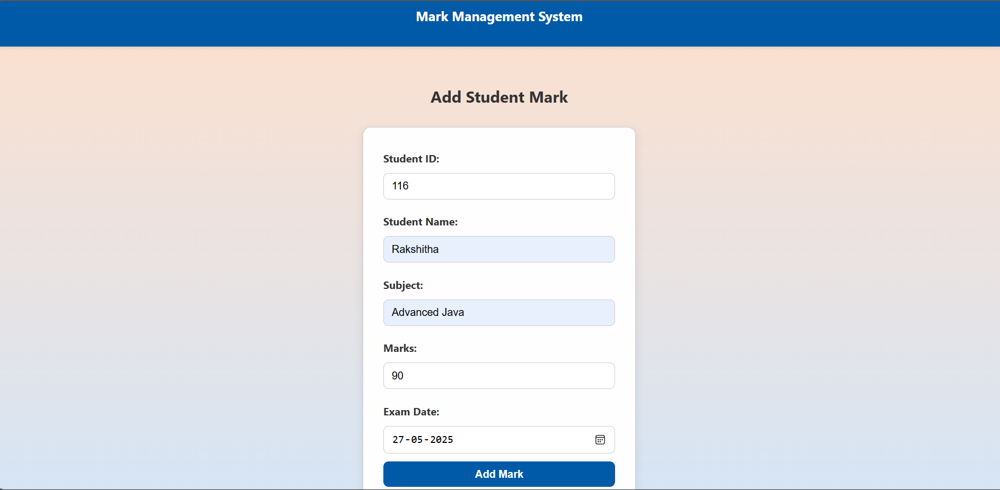
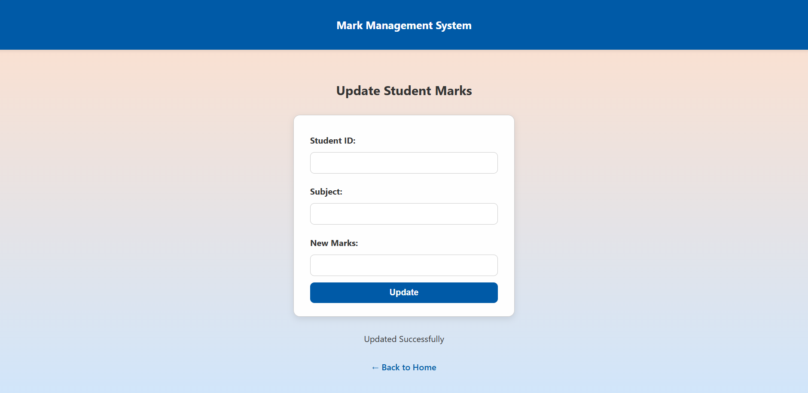
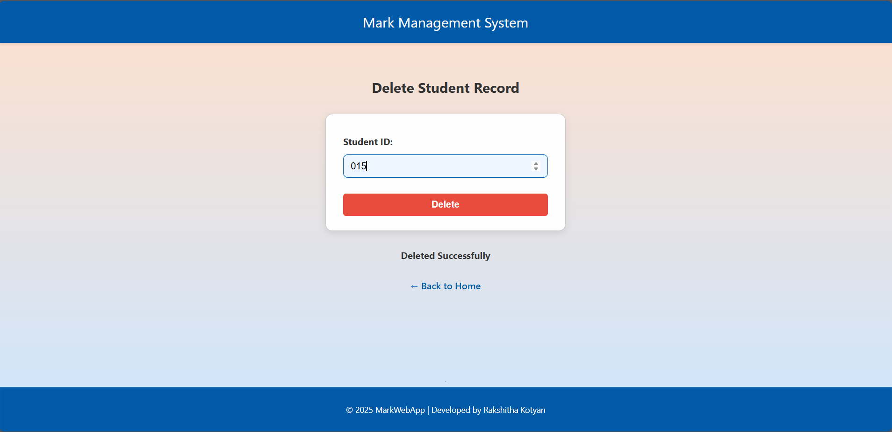
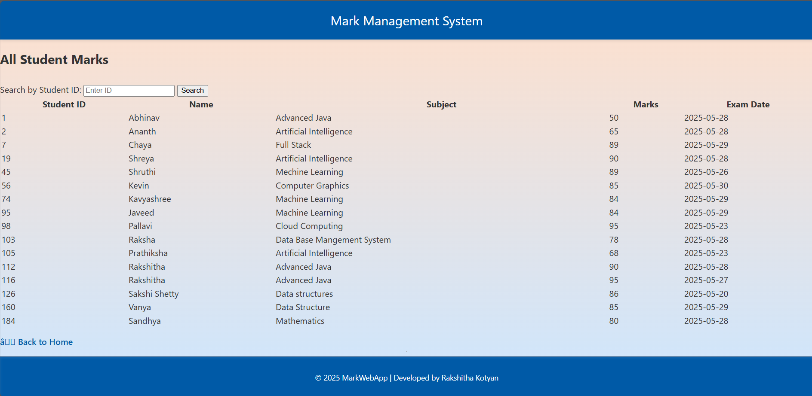
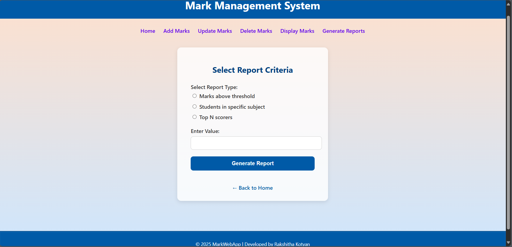

# Student Mark Management System

An easy-to-use web application designed to manage student exam marks efficiently. Built using JSP, Servlets, and MySQL, it follows the MVC architecture to ensure clean code structure and smooth functionality.


## 🚀 Features

- **Manage Student Marks**: Start by adding new student marks to the system  
- **Update Student Marks**: Edit the marks of existing students easily  
- **Delete Student Marks**: Remove a student's record using their ID  
- **Display All Marks**: View all student marks in a table format  
- **Generate Reports** based on different criteria:
  - Show students scoring above a given mark  
  - List students by subject  
  - View top N students by marks  
- **Input Checks**: Both client-side (JavaScript) and server-side (Servlet) validations  
- **Responsive Design**: Looks great on all devices using Bootstrap 
- **Database Integration**: Uses MySQL with JDBC for backend connectivity  


## 📋 Prerequisites

Make sure the following are installed:

- Java Development Kit (JDK) 8+
- Apache Tomcat 9.0+
- XAMPP
- MySQL JDBC Driver
- Java IDE (Eclipse)
- Web Browser (Chrome, Firefox, Edge)


## 🛠️ Project Structure

```
MarkWebApp/
├── src/
│   ├── dao/
│   │   └── MarkDAO.java
│   ├── model/
│   │   └── StudentMark.java
│   └── servlet/
│       ├── AddMarkServlet.java
│       ├── UpdateMarkServlet.java
│       ├── DeleteMarkServlet.java
│       ├── DisplayMarksServlet.java
│       ├── ReportServlet.java
│       └── ReportCriteriaServlet.java
├── WebContent/
│   ├── index.jsp
│   ├── markadd.jsp
│   ├── markupdate.jsp
│   ├── markdelete.jsp
│   ├── markdisplay.jsp
│   ├── reports.jsp
│   ├── report_form.jsp
│   ├── report_result.jsp
│   └── css/
│       └── styles.css
├── WEB-INF/
│   └── web.xml
└── README.md
```

## Database Setup

### 1. Create Student Database 

```sql
CREATE DATABASE IF NOT EXISTS mark_management;
USE mark_management;
```

### 2. Create StudentMarks Table

```sql
CREATE TABLE IF NOT EXISTS StudentMarks (
    StudentID INT PRIMARY KEY,
    StudentName VARCHAR(100) NOT NULL,
    Subject VARCHAR(50) NOT NULL,
    Marks INT NOT NULL,
    ExamDate DATE NOT NULL
);
```


## ⚙️ Installation & Setup

### Step 1: Download the Project
Organize project files according to the structure above.

### Step 2: Configure Database

1. Start MySQL server  
2. Run the SQL setup scripts  
3. Update DB credentials in `MarkDAO.java`:

```java
connection = DriverManager.getConnection(
    "jdbc:mysql://localhost:3306/student",
    "your_username",
    "your_password");
```

### Step 3: Add JDBC Driver

1. Download MySQL Connector/J  
2. Place the JAR file in `WEB-INF/lib`  
3. Add it to build path in IDE  

### Step 4: Deploy to Tomcat

1. Create a Dynamic Web Project in your IDE  
2. Copy files to corresponding folders  
3. Deploy to Tomcat and start server  

### Step 5: Run the App

```
http://localhost:8080/MarkWebApp/
```

## 🖼️ Screenshots

###  Home Page


###  Add Marks Page


###  Update Record


###  Delete Record


###  Display Marks


### Generate Report
#### Marks above threshold


## 🔧 Technical Features

### Validation

- **Client-side**: JavaScript, Bootstrap  
- **Server-side**: Java servlets  
- **DB-level**: Constraints like NOT NULL, PRIMARY KEY  

### Error Handling

- Try-catch for DB ops  
- Invalid input management  
